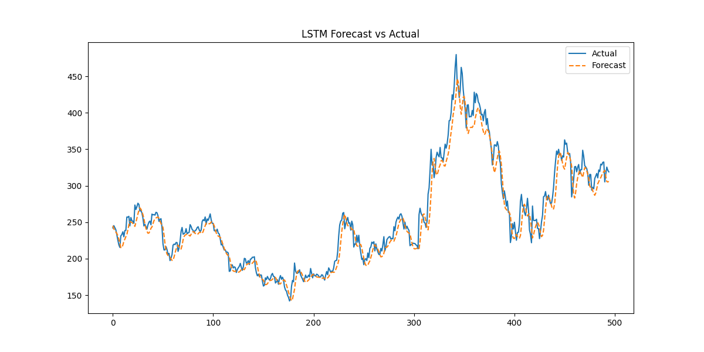
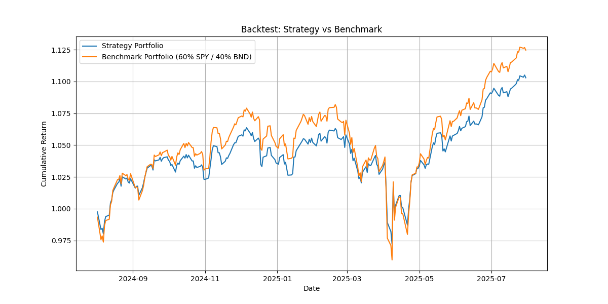

# 📈 Time Series Forecasting & Portfolio Optimization

Welcome to the **Time Series Forecasting** project! This repository demonstrates how to use machine learning and statistical models to forecast stock prices and optimize a portfolio using historical data.

---

## 🚀 Project Overview

This project focuses on:

- Loading historical stock data for **TSLA**, **BND**, and **SPY** using [`yfinance`](https://github.com/ranaroussi/yfinance)
- Applying **ARIMA** (AutoRegressive Integrated Moving Average) and **LSTM** (Long Short-Term Memory) models for time series forecasting
- Using the trained models for **portfolio optimization** and **backtesting** strategies

---

## 📦 Features

- **Data Loading:** Fetches daily price data for selected tickers
- **Modeling:** Implements ARIMA and LSTM for price prediction
- **Portfolio Optimization:** Allocates assets based on predicted returns
- **Backtesting:** Evaluates portfolio performance on unseen data

---

## 🛠️ Installation

1. Clone the repository:
    ```bash
    git clone https://github.com/estif-lul/time_series_forecasting.git
    cd time_series_forecasting
    ```

2. Install dependencies:
    ```bash
    pip install -r requirements.txt
    ```

---

## 📊 Usage

1. **Data Collection:**  
    The script uses `yfinance` to download historical data for TSLA, BND, and SPY.

2. **Model Training:**  
    - **ARIMA:** For statistical time series forecasting  
    - **LSTM:** For deep learning-based forecasting

3. **Portfolio Optimization:**  
    The predicted returns are used to optimize asset allocation.

4. **Backtesting:**  
    The optimized portfolio is evaluated on historical data to assess performance.

---

## 📝 Example

```python
import yfinance as yf
from arima_model import train_arima
from lstm_model import train_lstm
from portfolio import optimize_portfolio, backtest

# Download data
tickers = ['TSLA', 'BND', 'SPY']
data = yf.download(tickers, start="2015-07-01", end="2025-07-31")['Close']

# Train models
arima_preds = train_arima(data)
lstm_preds = train_lstm(data)

# Portfolio optimization
weights = optimize_portfolio(arima_preds, lstm_preds)
results = backtest(data, weights)
```

---

## 📚 Dependencies

- `yfinance`
- `pandas`
- `numpy`
- `scikit-learn`
- `statsmodels`
- `tensorflow` or `keras`
- `matplotlib`

---

## 📈 Results

- Visualizations of predicted vs. actual prices

- Portfolio performance metrics (returns, volatility, Sharpe ratio)

---

## 🤝 Contributing

Contributions are welcome! Please open issues or submit pull requests.

---

## 📜 License

This project is licensed under the MIT License.

---

## 🙏 Acknowledgements

- [yfinance](https://github.com/ranaroussi/yfinance)
- [statsmodels](https://www.statsmodels.org/)
- [TensorFlow](https://www.tensorflow.org/)

---

Happy forecasting! 🚀📊